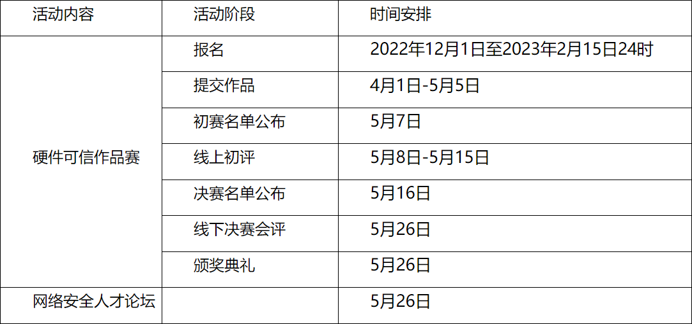

一、竞赛内容

华为公司提供大赛选题《第三届网络空间安全创新竞赛-华为硬件可信作品赛选题》，以硬件可信方向为主要，可涉及后量子密码硬件安全评测技术、后量子密码硬件加速和安全防御技术、可信根安全、处理器安全等，但不限于以上内容，鼓励从建议课题中选题，也可自主命题。

注：从建议课题中选题可加分，自主命题需提前与华为专家确认。

二、参赛对象

参赛对象为山东大学具有正式学籍的全日制在校学生。学生可自行组队参加，每支参赛队不超过4名学生（包括1名组长）。每支参赛队限指定1名校内指导教师，华为公司指定1名专家协助指导，每名学生限参加1支参赛队。作品赛决赛期间举行的网络安全人才创新创业发展论坛将面向全校师生。

三、参赛方式

作品赛分为初赛和决赛，初赛形式为线上网评，获得晋级决赛资格的队伍参加决赛现场展示。参赛队伍在确认成员和校内指导教师后请填写参赛报名表（报名表链接：https://www.wjx.cn/vm/wruZJ7F.aspx）。

四、时间安排

注：线下会评日期可能会根据学校有关新冠疫情防控的总体要求作出调整。

五、报名须知

大赛报名起止时间为：2022年12月1日至2023年2月15日24时。组委会于2月20日完成作品赛资格审查，并公布作品赛参赛名单。

更多报名事宜请咨询山东大学联络人赵老师，联系方式0532-58638630, 邮箱zhaojianwei@sdu.edu.cn。

六、其它事宜

1. 有关本届作品赛的重要通知和说明事项，由作品赛组委会通过山东大学网络空间安全学院官网、官方QQ群统一公告和通知。

2. 如新冠疫情防控形势有变化，组委会将认真将遵照国家和上级要求适时调整竞赛形式、竞赛时间或竞赛活动内容。具体情况会及时通过学院官网、官方QQ群统一公告和通知。

七、联系信息

1. 大赛联络人：赵老师，0532-58638630，zhaojianwei@sdu.edu.cn

2. 华为专家联系人：

    刘剑峰：13121069939，liujianfeng10@huawei.com

    周新平：18618423969，zhouxinping3@huawei.com

3. 秘书处通信地址：山东省青岛市即墨区滨海路72号山大青岛校区淦昌苑D座205-1室

4. 官方QQ群：628444866（第三届网络空间安全创新竞赛-华为硬件可信作品赛学生组长群）