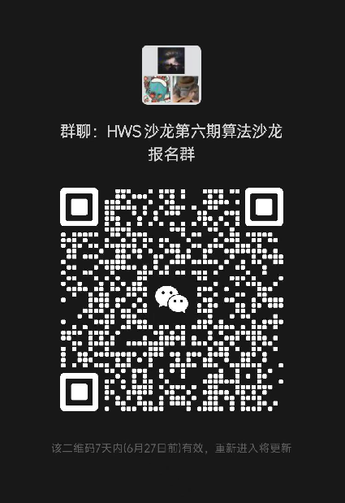

一、沙龙内容

为拓宽学生对计算机底层技术与网络空间安全的视野，提升对计算机行业的全景认知，山东大学将与华为联合举办HWS算法沙龙第六期-济南站山大专场活动。

本次活动隆重邀请各位同学来到山东大学济南校区，届时，我们的老朋友HWS计划创始人刘剑峰博士会给大家详细介绍华为底软业务，可以直接与专家现场面对面互动～一起沉浸式讨论学习、就业、深造、专业方向、兴趣选择、时间分配等等，为同学们提供更多的优秀实践经验分享。

同时，本次沙龙作为HWS夏令营软件赛道的预选赛，会组织一场ACM比赛，采用IOI赛制，出线的同学将有机会受邀参加HWS第七期夏令营活动，前往华为研究所实地参观和学习（约一周时间），并有机会赢取万元奖学金，欢迎各位同学踊跃报名！

二、活动对象

海内外全日制高校在校生。

三、活动时间与内容

上午：9:30~12:00

  《HWS系列活动介绍》

  《什么是底软——华为底软业务初探》

  《毕业去做什么——计算机及软件类行业职业规划》

  《ACM经典题解分析》

  《开放式论坛：读研还是就业，你会怎么选》

  自由研讨（答疑及互动）

下午：14:00~17:00

  ACM软件竞赛（IOI赛制）

晚上：18:30~20:30

  赛题解析

  自由研讨（答疑及互动）

四、参与流程

报名链接：(https://www.wjx.top/vm/exTYN0y.aspx)

五、联系信息

活动微信群：
    