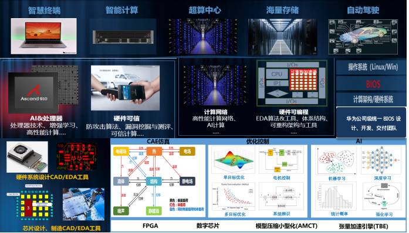

本次夏令营算法专场将与清华算法协会联合举办，往期内容可参考：https://mp.weixin.qq.com/s/56ben6AyGrqpnqr_cbIYIg

成功受邀参与线下活动的同学视为拥有夏令营入营资格

一、HWS活动介绍

HWS计划是华为对硬件安全及底软人才的培养计划，以“硬件安全及底软”为主题，寻找&培养最强“红武士”。 招收海内外全日制高校在校生，软件开发、软件测试、软件算法、二进制、IOT、底软、固件、芯片、内核、PWN、硬件安全及底软等方面的人才，打造硬件安全及底软领域冉冉升起的新星，去创造更美好的世界！我们将于2023年07月至2023年08月期间举办HWS第七期2023夏令营活动，欢迎各大高校学生积极报名参赛。最终会根据比赛成绩择优入围华为HWS第七期2023夏令营，优秀同学可获得华为实习及校招绿色通道。

二、部门介绍

2012实验室是华为公司的技术研究创新中心，专注于基础理论与前沿技术研究、产品技术竞争力的构建以及新产业孵化。业务涵盖了未来网络、人工智能、计算集群、芯片、操作系统、数据库、媒体技术、安全、精密制造等所有ICT相关领域。

中央硬件工程院隶属于2012实验室，承担了华为集团硬件工程的硬件架构及关键技术突破的重任，是世界级软硬件工程模式、方法、硬件系统创新的核心引擎 & 硬件公共技术能力中心，探索并孵化领先的计算/无线/网络领域的硬件系统，牵引硬件关键技术的摸高和集成验证，支撑Cloud&AI、5G、自动驾驶、终端等产品竞争力持续领先。

部门面向公司战略业务场景，包括Cloud&AI、5G、自动驾驶、终端等，核心业务聚焦：

1. 横向硬件系统的创新：打破现有技术边界并进行架构创新，规划与实施领先业界的计算/无线/网络等领域的硬件工程样机；

2. 纵向公共硬件技术突破：瞄准“计算领先、可信底座”，探索AI&处理器、硬件可信与安全、高性能计算网络、硬件EDA、FPGA应用等前沿技术。

三、沙龙介绍

为拓宽学生对计算机底层软件技术视野，提升对计算机行业的全景认知，现举办HWS算法沙龙第六期-杭州站活动。

本次活动隆重邀请各位同学来到杭州市，届时，我们的老朋友HWS计划创始人刘剑峰博士会给大家详细介绍华为底软业务，可以直接与专家现场面对面互动～一起沉浸式讨论学习、就业、深造、专业方向、兴趣选择、时间分配等等，为同学们提供更多的优秀实践经验分享。

同时，本次沙龙作为HWS夏令营软件赛道的预选赛，会组织一场ACM比赛，采用IOI赛制，出线的同学将有机会受邀参加HWS第七期夏令营活动，前往华为研究所实地参观和学习（约一周时间），并有机会赢取万元奖学金，欢迎各位同学踊跃报名！

四、活动对象

参赛对象为海内外全日制高校在校生。

五、活动时间与内容（具体活动内容可能会有调整，以实际发布为准）

讲师介绍：

陈鸿基，清华大学学生算法协会资深会员，广泛参与校内外大型算法竞赛命题及验题工作，为多届清华大学学生程序设计竞赛暨高校邀请赛（THUPC）累计提供11题，为 CCF CSP 计算机软件能力认证提供2题。此外还曾担任清华算协于2022年首次举办的暑期培训的主要授课者。

日程安排：

09:00~09:30  破冰小游戏

09:30~09:45 《HWS系列活动介绍》

09:45~10:00 《什么是底软——华为底软业务初探》

10:00~10:15 《毕业去做什么——计算机及软件类行业职业规划》

10:15~11:45 《数论例题选讲》

11:45~12:15 《开放式论坛：读研还是就业，你会怎么选》

13:30~17:30  ACM软件竞赛（IOI赛制）算法挑战

18:30~19:30  赛题解析

19:30~20:30  自由研讨（答疑及互动）

六、参与流程

报名链接：(https://www.wjx.top/vm/mbkPPRh.aspx)

七、联系信息

活动交流QQ群：
    