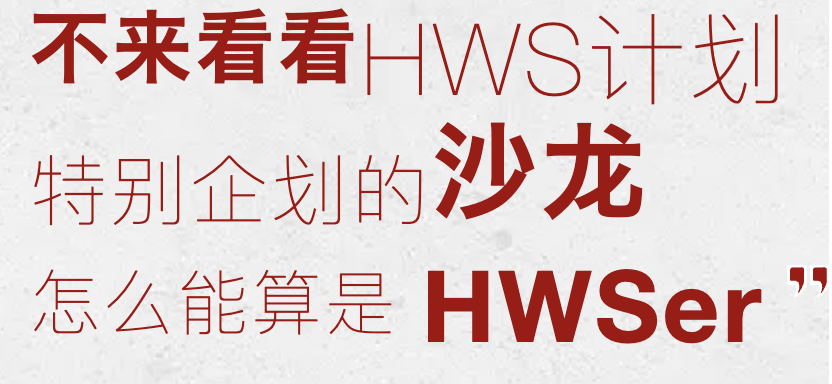
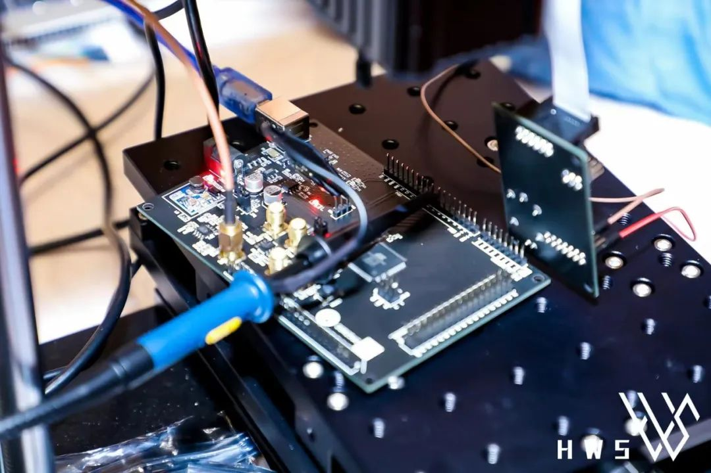

<!--StartFragment-->

*沙龙议题分享实操实战提供开发板*

**议题一：**

**硬件安全初体验-侧信道实战演练** 

第一讲：密码算法简介

第二讲：简单能量分析

第三讲：相关能量分析

第四讲：模板分析

第五讲：侧信道防护对策

第六讲：面向防护对策的针对性侧信道分析

第七讲：侧信道分析测评实战案例分享

第八讲：侧信道计时分析与缓存分析

第九讲：国际侧信道攻击实际案例概述

*课程提供侧信道设备及开发板 全场实操实战*

**讲师：王安**

北京理工大学网络空间安全学院研究员，博士生导师，中国密码学会密码芯片专业委员会委员，《密码学报》编委，主要研究方向为密码工程与侧信道攻防技术。2011年博士毕业于山东大学数学院信息安全专业，随后进入清华大学从事两站博士后研究工作，2015年进入北京理工大学计算机学院任教至今。主持国家自然科学基金等9项国家级或省部级科研项目，获党政密码科学技术进步奖、AsiaJCIS 2018/ChinaCrypt 2015/CryptoTE 2021/全国密码学与信息安全教学研讨会等会议最佳论文奖、中国博士后科学基金特等和一等资助，发表学术论文70余篇。

**议题二:**

**从HITCON18赛题superhexagon理解armv8**

本题就像是在ARM系统中一次精彩的探险之旅。出题人仅用1M大小左右的固件，构造出了ARM世界近乎完整的探险地图。在漫长的旅途中，我们要一路披荆斩棘，从手无寸铁的用户态EL0起家，历经内核态EL1，虚拟机管理器EL2，安全世界用户态S-EL0，安全世界内核态S-EL1，最终夺取目标处理器的最高权限EL3。精彩也意味着复杂，把这个题目给大家讲清楚就更难了。为此，我用了将近两个月的课余时间，却只完成了本题一半的课件，即完成到EL2。也是最近实在太忙，的确没有时间完成后三关，希望未来有缘再续。因此，本次为期两天的分享包括：从用户态到内核态；从内核态到hypervisor。
需要相关基础：

1. Pwn（内存破坏漏洞分的析与利用）
2. 了解ARM指令集

*课程提供ESP32开发板 全场实操实战*

**讲师：王宇轩**

清华大学Redbud战队成员，主要研究ICS、IoT领域的安全问题。曾合作完成对小米音响、新宝骏汽车、华晨中华V7汽车的破解，并获2020天府杯最佳漏洞演示奖。    

博客：https://xuanxuanblingbling.github.io/

<!--EndFragment-->