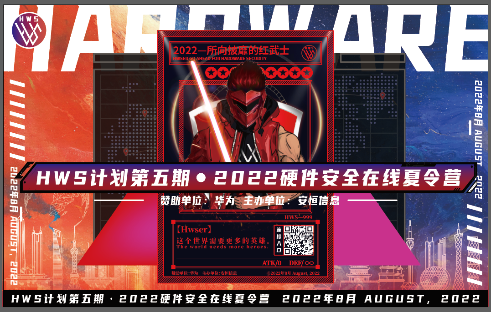

# HWS计划在线夏令营

HWS计划系列活动，是由安恒信息主办，华为独家赞助，HWS计划是华为对硬件安全人才的培养计划，以“硬件安全”为主题，寻找&培养最强“红武士”。

本次特别企划，采用在线夏令营学习+线下沙龙交流形式，沙龙将在全国有华为研究所的城市巡回开展*（具体开展城市由各位HWSer来选择*）

本次在线夏令营招收海内外全日制高校在校生，二进制、IOT、底软、固件、芯片、内核、PWN、硬件安全等方面的安全人才，打造硬件安全领域冉冉升起的新星，去创造更美好的世界！

# 一如既往的“硬核”

### 滚动积累的独家学习资料

现报名可获得的HWS独家学习资料，包含二进制、PWN、IoT安全、故障注入、侧信道等等方向经验分享。

（老HWSer都知道往年培训录播保留成为下一次活动学习资料，每年留存的一手资料你不想获取吗？）

再次升级的高质量赛题

HWS出马，就知有没有！本次预选赛赛题增加赛题类型，难度升级，时长增加，持久拉力赛一触即发！

### “为爱发电”的免费精华课程分享

本次活动在线讲座及在线夏令营的所有课程依旧免费，多个硬件安全专家“为爱发电”，精品课程培训不容错过。

### “不离不弃”的老朋友全程陪伴

伴随HWS计划创立成长的老朋友--华为“心灵导师”，将全场陪伴HWSer的学习、分享，另外优秀学员还可获得华为实习的优先录取资格。

# 意想不到的“创新”

### 夏冬令营改版，沙龙驾到

夏令营调整为线上模式，打破空间局限，让更多的同学的参与学习。沙龙采用线下模式，实地分享，沉浸式交流学习。线上线下结合，活动形式丰富。

### 多主题沙龙，多城市巡回

多城市巡回的沙龙，希望用“HWSer不动，沙龙动”的形式，最大限度的减少外在因素影响，降低风险。且每场沙龙将根据各城市华为研究所的特色设计主题，别具一格。

### 多角度感受华为氛围

不同的城市，不同的环境，不同的主题，多角度深入感受华为氛围！！！

# 活动日程安排

1. 线上报名：

    即日起至7月27日18:00

2. 线上讲座（公开课）：

    7月26日 18:30 -20:30，面向所有报名学员

3. 预选赛：

    7月29日09:00 - 8月1日21:00

    竞赛模式：个人赛

    赛题类型：常规CTF+RW+硬件类（密码/侧信道）

    参赛地址：hws2022.dasctf.com（28日12:00后开放登陆测试）

4. 在线夏令营：

    8月8日-8月12日 每日18:30-20:30

    HWS晚间课堂与你相约❤️（具体课程信息下周揭晓）

5. 多主题巡回沙龙：

    场次时间地点待定......

    但是！时间地点由你来选

    北京/上海/深圳/西安/杭州/东莞/武汉/成都等有华为研究所的城市均可选择

    （报名时，各位HWSer请投票选择希望举办沙龙的城市和时间，HWS会根据投票结果计划时间地点开展沙龙）

# 活动报名通知

招募对象：

  海内外全日制高校在校生，二进制、逆向、IoT、硬件安全等方向的安全人才

招募计划：

  招募计划线上赛排名 Top50 -100（视报名情况进行调整）可获得在线夏令营入营资格及线下沙龙席位，另设20个绿色通道申请名额，给错过报名/比赛却想参与活动的同学（有意向的选手可在报名表单中，提交简历进行申请）。

报名方式：

  扫描下方二维码填写信息进行报名，或者关注「数字人才创研院公众号」发送“HWS”获取报名链接。（报名表单中设置沙龙举办地及时间的投票，HWSer快来为自己方便的时间及期望的城市投上一票吧）

报名通知：

  报名过程中组委会将陆续审核选手报名信息，审核通过后将会给学员发送通知邮件，邮件内包含往期HWS学习资料，线上赛地址等详细信息。
