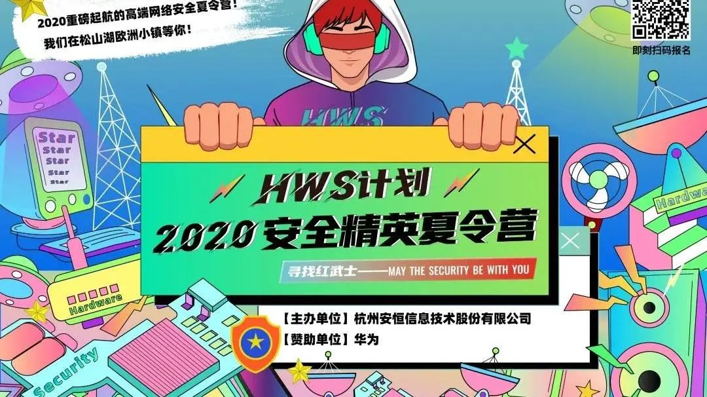
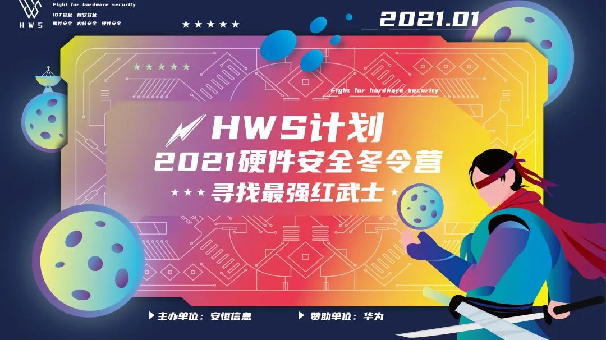

**导语：**

HWS计划系列活动，是由安恒信息主办，华为独家赞助的硬件安全主题活动。目前已经开展至第五期，让我们来看看前四期的风采吧！

# HWS-01 2020安全精英夏令营

HWS计划第一期邀请行业内顶尖知名CTF战队队员设计了超多干货课程，进行为期5天的线上免费直播教学。（赶快来报名获得往期HWS独家学习资料）

线下训练营也保持高质量的追求，邀请了业界翘楚为学员们打开底层安全世界大门。内核安全、硬件安全、固件安全、实操课程；理论+实操的丰满课程设计，舒适的学习生活环境，还有万元大奖任性倒贴，收获满满好评！

# HWS-02 2021硬件安全冬令营

HWS计划第二期**首发侧信道实操课程**（侧信道分析原理培训及实战、故障注入分析原理培训及实战、芯片微架构安全技术理论培训及案例分享等），并独家定制硬件安全实验板，学员动手能力UP UP UP！实战技能拉满！

第二期开启“硬核”结营赛，与华为精英战队同场竞技、一较高下。比赛分为开发板赛题、演示类赛题、常规CTF类赛题，赛题类型包括单板安全、硬件安全、固件安全、可信计算、芯片安全、物联网设备安全。（赛题多种多样，HWSer比得畅快）

第二期课程撞上元宵，各位HWSer欢聚一堂，聚餐、游戏、抽奖，气氛热烈。

结营仪式同沙龙论坛会共同举办，论坛会上各专家大牛分享CTF战队经验，并且每个在结营赛中拿到first blood的红武士也进行了自己的思路分享。可谓是知识盛宴，最后对成绩优异的学员，还进行丰厚的奖金激励。

# HWS-03&04 2021-2022硬件安全在线夏冬令营

HWS计划第三期第四期受环境因素影响，修改为在线夏冬令营的形式开展。在线夏冬令营累计10日专业课程、50h+的学习时长、BlackHat的视野拓宽，硬件攻防的创新赛题研究，隔空相见的在线夏冬令营，大家热情依旧。

在线夏冬令营设专家答疑及分享会，邀请学员提问，或是某题目的不解，或是刚进入硬件安全领域的学习规划困扰，或是读研读博方向的迷茫，或是职业道路前行的踌躇，HWS的常驻硬件安全专家Dr. 刘，亦师亦友，凭其多年硬件安全领域经验沉淀以独到的视角为学员提出建议，用先辈经验给予指引。学习之余，同学们也侃天说地，还进行唱歌、乐器等才艺分享，好不欢乐。

