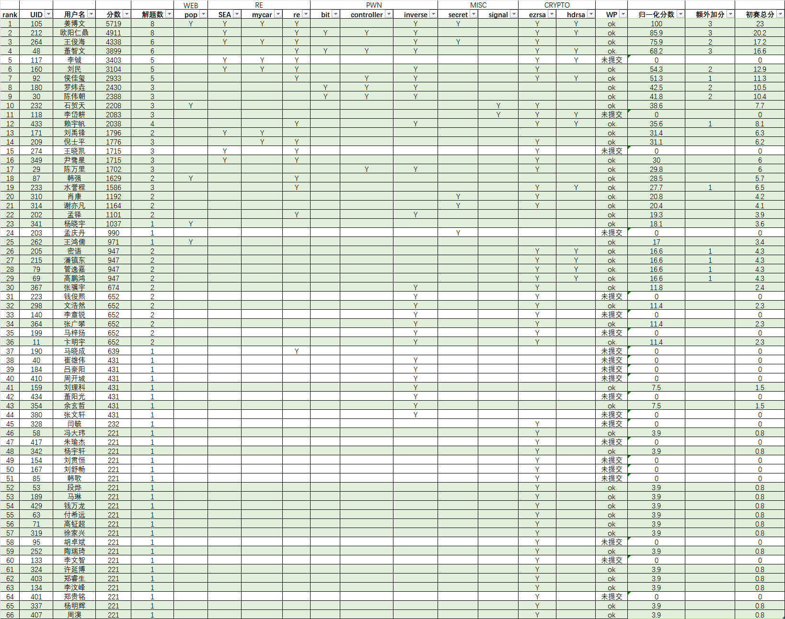

## 比赛成绩公示

网络安全赛道CTF初赛比赛结束，经过工作人员审核，如下数据是本次初赛结果。

其中涉及到归一化分数、额外加分与初赛总分三个数值：

1）归一化分数：当前选手分数/第一名分数*100，保留小数点后一位

2）额外加分：对于除WEB外其余分类赛题全部解出可以额外加分，RE/PWN/MISC加2分，CRYPTO加1分

3）初赛总分：归一化分数*20%+额外加分

上述同学经初审后成绩有效，公示截至11月21日17时，若无异议则【初赛总分】不为0的同学视为晋级。

未提交WP的选手可以在QQ群（766705270）里联系【网络安全赛道负责人】进行补交。

已提交的WP公示地址：[writeup.tar](writeup.tar)，针对公示的WP有异议的选手可以将具体信息发送到 1924594189@qq.com 进行申诉。

## 绿色通道入围公示

申请绿色通道审核通过的选手名单（第一批）如下:

王宁，傅晋元，温祖彤，何彦成，费磬远，王昊，接照东，谢震涛

有意参与线下活动的同学可以继续申请绿色通道入围，绿色通道截止至11月24日12时，请关注Q群通知

## 入围问卷调查（绿色通道申请）

请上述公示成绩有效选手与绿色通道审核通过选手填写如下问卷，其余有意向申请绿色通道的同学也可填写

https://www.wjx.cn/vm/Y32sMzB.aspx# 