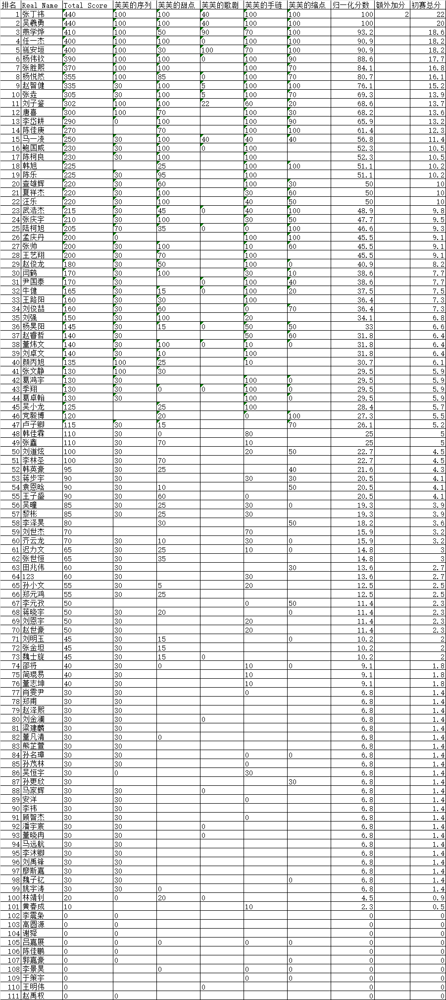

## 比赛成绩公示

软件算法赛道初赛比赛结束，如下数据是本次初赛结果。

其中涉及到归一化分数、额外加分与初赛总分三个数值：

1）归一化分数：当前选手分数/第一名分数*100，保留小数点后一位

2）额外加分：【张丁祎】同学找到【芙芙的甜点】数据问题，特此奖励2分

3）初赛总分：归一化分数*20%+额外加分

上述成绩仅为初赛结束时成绩排名，尚未经过审核，代码公示截止至11月21日17时，审核通过后且【初赛总分】不为0的同学视为晋级。

选手提交代码将在平台上公开查看，针对公示的代码有异议的同学可以将具体信息发送到 2497143711@qq.com 进行申诉。

## 绿色通道入围公示

申请绿色通道审核通过的选手名单（第一批）如下：

李梓阳，尹永琪，杨朝平，涂鸿铭，李洋，温祖彤，付栋杰，吕松霖，陈雨禾，汪嘉华，王昊
    
有意参与线下活动的同学可以继续申请绿色通道入围，绿色通道截止至11月24日12时，请关注Q群通知

## 入围问卷调查（绿色通道申请）

请上述公示成绩有效选手与绿色通道审核通过选手填写如下问卷，其余有意向申请绿色通道的同学也可填写

https://www.wjx.cn/vm/Y32sMzB.aspx# 