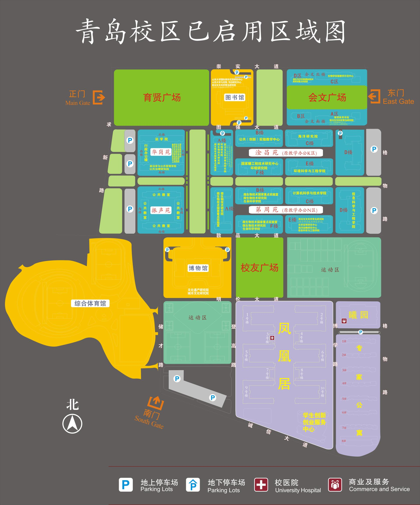
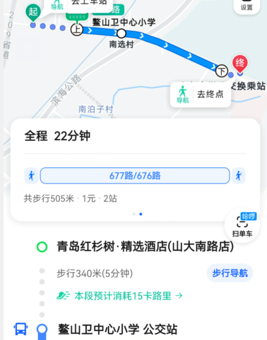
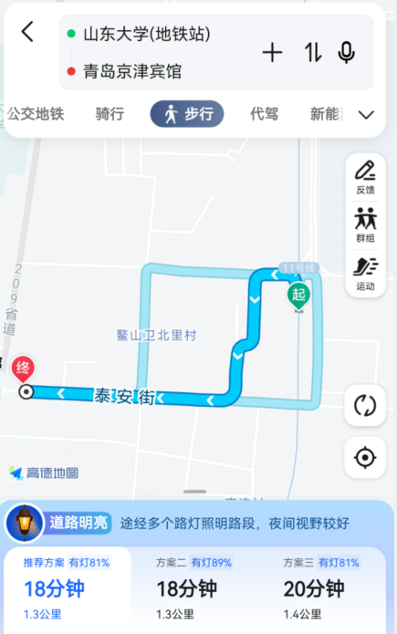
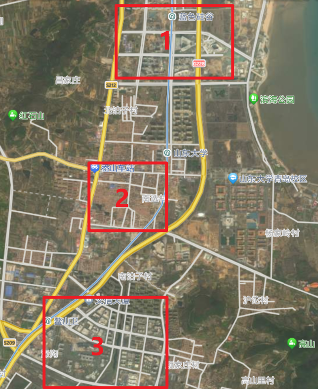

## 活动简介

HWS计划是华为对网络安全以及软件算法人才的培养计划，自20年第一期以来已筹办七期。活动以线上选拔赛+线下沙龙+冬夏令营的形式为主，最初聚焦硬件安全专项，并于华为溪村举办线下培训及寒暑期结营赛，每期均有万元大奖等待选手冲击，**优秀营员可获得华为实习及校招绿色通道**。活动自第四期起加入线下沙龙活动，于全国多地华为研究所进行议题研讨；第六期起与各大高校合作，如清华、浙大、山大等；第七期起加入软件算法内容，寻觅更加全能型的你！

本次活动依托山东大学青岛校区网络空间安全学院举办。学院拥有一支高水平教学科研团队，以密码技术与信息安全教育部重点实验室为依托平台，在网络空间安全研究领域成绩斐然；学院面向我国网络空间发展和安全需求，在人才培养方面涵盖密码学、网络与系统安全、网络空间安全基础理论3个方向，培养具有扎实网络空间安全理论基础和专业知识，在密码学和网络与系统安全领域具有较强的独立科研能力以及工程实践能力，具备社会责任感与创新精神的高层次复合型人才，欢迎各位同学报考山东大学网络空间安全学院。

## 出行指南

**特别注意：请申请差旅补助的同学保留火车票或行程单等报销凭证**

***推荐大家周五晚18点前到达酒店，以参与周五晚的自由交流活动。**

### 校园地址：

山东大学青岛校区位于山东省青岛市即墨滨海路72号。

周边地铁站有十一号线山东大学站（近正门），鳌山卫站（近南门）。

公交站有山东大学站（近正门），山东大学公交换乘站（近南门）。

### 交通枢纽:

胶东机场/红岛火车站：地铁 8 号线转 3 号线转 2 号线转 11 号线，时间约2.5h，打车约170元，时间1.5h；

青岛站/青岛北站：地铁 3 号线转 2 号线转 11 号线，时间约1.5h；打车约120元，时间1h；

即墨北站：公交 即墨2136路，时间约1.5h；打车约70元，时间1h；

### 注意：

如落地后希望赶到校区附近，红岛/机场不要买到达时间晚于八点的，青岛/青岛北/即墨北不要买到达时间晚于九点的，不要购买前往青岛西的车票。优先推荐青岛北或即墨北。推荐大家晚18点前到达酒店。

活动地点位于淦昌苑D座，近正门，推荐从正门进入；南门存在交通换乘站，需要乘坐公交的同学也可通过南门出入。

### 公共交通运营时间:

一般公交运营时间：早六点至晚九点；

地铁运营时间：早六点至晚十点；

### 校园内交通：

活动地址：淦昌苑D座网络空间安全学院

正门步行约5分钟，南门步行约15分钟。

### 入校相关：

校内人凭山大校园卡/校友卡可刷卡出入；

校外人待统一填写入校申请后可刷身份证出入；

## 住宿指南

### 本次活动推荐酒店

| 名称 | 房型 | 距离 | 酒店附近站点 | 接驳信息 |
| --- | --- | --- | --- | --- |
| 京津商旅酒店 | 双人标间 | 约1km到正门 | 山东大学地铁站 | 提供3-4人/车次送至学校服务 |
| 红杉树酒店 | 双人标间 | 约1.5km到南门 | 鳌山卫中心小学公交站 | 无接驳 |

（相关交通说明图）

### 重点说明

如选择以上两家酒店，会务组将会务组将统一分配住宿并**垫付住宿费用**，并从差旅补助中**优先扣除**。

如选择其他酒店，需自行垫付并按要求开具发票，具体补贴额度待定，发票开具所需信息将后续通知。

### 其他

此外学校周边有三大片区的住宿解决方案，如上图所示：

| 序号 | 名称 | 类型 | 距离 | 交通 | 接驳 |
| --- | --- | --- | --- | --- | --- |
| 1 | 蓝色硅谷站片区 | 公寓 | 较远 | 公交到达正门 | 不存在 |
| 2 | 山东大学站片区 | 民宿/宾馆 | 较近 | 公交到达南/正门 | 部分存在 |
| 3 | 鳌山卫站片区 | 酒店 | 最远 | 公交到达南门 | 部分存在 |

其他片区部分酒店参考

| 名称 | 片区 | 距离 | 交通 |
| --- | --- | --- | --- |
| 铂缦公寓 | 1 | 约2km到正门/北门 | “硅谷大厦站”，公交到达正门 |
| 格集曼酒店 | 3 | 约5km到正/南门 | “鳌山卫车站”，公交到达正/南门 提供3-4人/车次送至学校服务 |
| 汉庭酒店 | 3 | 约3km到南门 | “海创中心站”，公交到达南门 |

## 餐饮指南

1. 校内食堂三楼

可接受微信支付；距会场步行约5分钟，营业时间：7:00-9:00，11:00-13:00，16:30-18:30

2. 校区双创商业街

提供各类餐食；距会场步行约10分钟 全天营业

3. 校区正门西，泰安街

距会场步行约15分钟 全天营业（如前图示区域2）

4. 校区北，蓝谷中心

距会场步行约20分钟 （如前图示区域1）

## 活动议程

### 活动时间表

| 11.24周五 | 11.25周六 | 11.26周日 |
| --- | --- | --- |
|  | 9:00-12:00   第一场议题分享  | 8:45-11:45     算法赛道：决赛    安全赛道：华为专家交流，初赛赛题解析 |
|  | 13:30-17:30    第二场议题分享  | 12:15-17:30    安全赛道：决赛    算法赛道：华为专家交流，初赛赛题解析 |
| 19:00-21:00     华为专家交流（自选参与） | 18:30-21:00     开放式论坛：    什么是底软——华为底软业务初探    读研还是就业，你会怎么选    毕业去做什么——计算机及软件类行业职业规划    …… | 19:00-21:00    颁奖    决赛题目解析    |

## 议题分享

根据前期议题提议汇总与相关的工业界前沿研究，特选择如下议题：

1. 初识UEFI PWN

2. 算法竞赛中的动态规划解题分享

3. AI图像处理

4. 前沿课题：机器学习网络攻击流量识别

……

